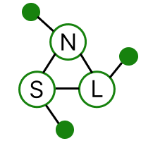

# NSL Website 

This is the website of the Networked Systems Laboratory (NSL) at the University of Southern California.

We thank [Allan lab](http://www.allanlab.org/aboutwebsite.html) for the template.

## Installation

- Install Jekyll: [Jekyll for Ubuntu, MacOS, Windows](https://jekyllrb.com/docs/installation/)
- `bundler install`
- `bundler exec jekyll build` - Website will be built
- `bundler exec jekyll serve` - Website will be served on localhost:4000

## Steps to update the website

- `git clone https://github.com/USC-NSL/USC-NSL.github.io.git`
- `cd USC-NSL.github.io`
- `git checkout -b main` -> Branch containing the website source code.
- Make changes only to the main branch and commit. An automated worflow deploys the website from main branch to the gh-pages branch.

## A note on bibliography entries

Our website uses jekyll/scholar. To have a publication show up on our pubs page, all you need to do is to add your bib entry to `_bibliography/papers.bib`. Then, when you push your changed, github will automatically populate the pubs page.

When you add a bib entry, you can use the following fields that have special meaning:

- `abbr` adds a badge to the publication. For example, `abbr = {NSDI}` will add an NSDI badge to the pub.
- `code` is a link to a github repository containing code released associated with the paper. If this entry is present, then a "code" button appears under the paper's entry.
- `slides` is similar to `code`.
- setting `bibtex_show` to 1 will add a `bib` button, which, when clicked, will reveal the bib entry.
- `selected = {yes}` will add your paper to `Selected Recent Publications` section in NSL homepage. **Note:** Only 5 papers can be added to this section. Currently, 5 papers in order from the top of `_bibliography/papers.bib` with `selected = {yes}` will appear. 

Check `_layouts/bib.html` to see how the fields are configured.

## Add/Update personal page

### Create a new page

We have a sample one page template for personal webpage at `_layouts/personal.html`. Example page that follows the template is located at `_pages/people/rajrup.md`. You can make a copy of this page and update the contents from your old page.

Steps to update your personal page:

- Create a page under `_pages/people/` with your preferred name say `foo.md`. Add/update the `title`, `permalink` and `excerpt` fields, while the other fields `layout` and `sitemap` should have values `personal` and `false`, respectively.
- Create a copy of contents under `_data/people/`. Example contents are located at `_data/people/rajrup.yml`. Note that the name of this file should be the same as the name of the page, e.g. `foo.md` should have `foo.yml` as its contents.
- Jekyll uses `liquid` style for templating. You can use liquid tags to add/update the contents of the page as `rajrup.md` does.
- Create a `.bib` file for publications under `_bibliography/people/`. An example `.bib` file is located at `_bibliography/people/rajrup.bib`. If your bib file is named `foo.bib`, then update the code to generate the bibliography as ``. You should find the use of this command at the end of `_pages/people/rajrup.md`.
- Update the link to your page in `_data/team.yml`. For example, if your `permalink` is `/people/foo/`, then update the link to your page as `current-students.<your_name>.social.website = https://usc-nsl.github.io/people/foo/`.
- You can also add redirections to your personal page. This is very helpful when migrating from our old website to preserve same old url pointing to your new page. For example, if your personal page is `/people/foo-bar/` and you want `/people/foo/` and `/people/bar/` should redirect to `/people/foo-bar/`, you can add `redirect_from` at the top of `foo.md` with the value `/people/foo/` and `/people/bar/`. Check out redirections in `_pages/people/fawad.md` and `_pages/people/ramesh.md`.

### Add link to existing website

If you have your own website, you can provide the link in `_data/team.yml` file under `current-students.<your_name>.social.website`.

## Add/Update project page

We have created project pages for 2 current projects located at `_pages/projects/`. You can make a copy of these pages and update the contents for your projects.
The project pages will have url as `https://nsl.usc.edu/projects/<project_name>/`.

## Contact

- Rajrup (Raj): Reach out via Slack or email for any questions, access, etc.
- Ramesh
- Barath
